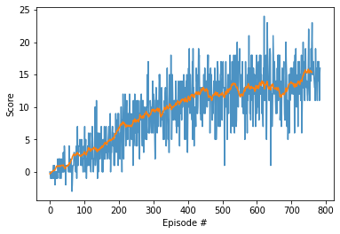

[//]: # (Image References)

[image1]: images/agent.gif "Trained Agent"

# Banana Collector Navigation using DQN 

## Introduction

An Implementation of Deep Q-Network Reinforcement Learning algorithm in Unity's Banana Collector environment.

![Trained Agent][image1]

## Environment

The environment is a simulation of a large square world with blue and yellow bananas placed randomly.

A reward of +1 is provided for collecting a yellow banana, and a reward of -1 is provided for collecting a blue banana. 

| Environment Properties         |  |
|-------------------|------------------------|
| Environment       | Unity Banana Collector |
| Type              | Episodic Task          |
| Trials            | 100                    |
| Observation Space | Box(37,)               |
| Action Space      | Discrete(4,)           |
| Reward            | (-inf, inf)            |
| Required Score    | 13                     |
| Trials            | 100                    |
| Solved in         | 533 episodes           |

The state space has 37 dimensions and contains the agent's velocity, along with ray-based perception of objects around agent's forward direction.  

Four discrete actions are available, corresponding to:
- **`0`** - move forward.
- **`1`** - move backward.
- **`2`** - turn left.
- **`3`** - turn right.

To consider the environment as solved, the agent must get an average score of +13 over 100 consecutive episodes.

## Getting Started

1. Clone/Download this repository 
2. Download the environment from one of the links below.  You need only select the environment that matches your operating system:
    - Linux: [click here](https://s3-us-west-1.amazonaws.com/udacity-drlnd/P1/Banana/Banana_Linux.zip)
    - Mac OSX: [click here](https://s3-us-west-1.amazonaws.com/udacity-drlnd/P1/Banana/Banana.app.zip)
    - Windows (32-bit): [click here](https://s3-us-west-1.amazonaws.com/udacity-drlnd/P1/Banana/Banana_Windows_x86.zip)
    - Windows (64-bit): [click here](https://s3-us-west-1.amazonaws.com/udacity-drlnd/P1/Banana/Banana_Windows_x86_64.zip)
    
    (_For Windows users_) Check out [this link](https://support.microsoft.com/en-us/help/827218/how-to-determine-whether-a-computer-is-running-a-32-bit-version-or-64) if you need help with determining if your computer is running a 32-bit version or 64-bit version of the Windows operating system.

3. Place the file in the root of this repository folder, and unzip (or decompress) the file. 

4. Navigate to python folder and execute the following command to install the dependencies 
`pip install .`
5. You can now open the `Navigation.ipynb` Notebook and execute the cells.

## Algorithm

#### Deep Q-Network (DQN)

This project is an implementation of a value-based Reinforcement technique called as **Deep Q-Network**. It uses the Q-Learning (SARSA-max) algorithm with a deep convolutional neural network to predict the next Action for the agent for a given agent State.

This implementation is further improved with **Experience Replay** technique. In this technique we store the agent's experience <sⱼ, aⱼ, rⱼ, sⱼ₊₁> at each time step in a buffer called as replay memory. Once we have adequate samples in the replay memory, we train the Q network using a randomly picked experiences minibatch from the replay memory. 
In this project, replay memory is implemented as a circular queue which discards the oldest experience when a new experience is added.

##### Neural Net Architecture
The Implementation uses a Fully Connected Neural Network containing following layers
1. Input Layer containing neurons equal to number of the state.
2. 2 Dense Layers with 256 neurons each with ReLu activation function.
3. 1 Dense Layer with neurons equal to number of actions .

#### Final Algorithm {#algorithm}
```
initialize replay memory D
initialize action-value function q̂ with random weights w
initialize target action-value weights w⁻ ← w
repeat for each episode
    observe initial frame x₁
    prepare initial state S ← F(<x₁>)
    repeat for each time step
        select an action A
            with probability ε-Greedy select a random action
            otherwise select A = argmax Q(S,A')
        Take action A and observe reward R and new frame xₜ₊₁
        prepare next state S' ← F(<xₜ₋₂, xₜ₋₁, xₜ, xₜ₊₁>)
        store experience <S, A, R, S'> in replay memory D
        S ← S'

        sample random minibatch <sⱼ, aⱼ, rⱼ, sⱼ₊₁> from replay memory D
        calculate target for each minibatch transition
            if sⱼ is terminal state then yⱼ = rⱼ
            otherwise yⱼ = rⱼ + γmaxₐq̂(sⱼ₊₁, a, w⁻)
        train the Q network using minibatch
        w⁻ ← w
```

## Implementation

This code uses 2 models (local and target) for implementing Fixed Q Model. The local model is used for calculating the action using current state, as the Agent gathers new experience. 

When updating the model, the local model is trained using the mini-batch while the weights of target model are updated by a factor of TAU of the weights of local model.

The code is seperated into 3 files:

* `model.py` file contains the 3 layer Neural Network model written in PyTorch Framework.
* `dqn_agent.py` contains the implementation of [Deep Q-Learning algorithm](#algorithm) along with experience replay as described above. 
  * The replay memory is implemented as a circular queue in `ReplayBuffer` class.  
  * The Agent is implemented as `Agent` class containing the following methods : 
    * `step()` : This method saves the agent's experience for the current time step into the replay memory and also descides if agent has gathered enough new experience to train the models.
    * `act()` : This method returns the appropiate action for the the agent using the current policy derived from the local model.
    * `learn()` : This method calculates the gradients using a mini batch from replay memory and updates the weights for local model. It also further calls *soft_update()*
    * `soft_update()` : This method updates the weights of target model using weights of local model. It multiplies the weights of local model by a factor of TAU before updating the target model.
* `Navigation.ipynb` is a jupyter notebook which contains code to train the Agent as well as later see the Agent perform in the Unity's Banana Collector environment.

The following parameters were used while training the Agent
| Parameters | Value |
|-|-|
| Replay Memory Size | 100,000 |
| Mini Batch Size | 64 |
| Discount factor | 0.99 |
| TAU for soft updating<br>target network | 1e-3 |
| Frequency for updating<br>the network | 4 Time-steps |
| Neural Network Layers | Layer 1 = 37 (Observation Space)<br>Layer 2 = 256<br>Layer 3 = 256<br>Layer 4 = 4 (Action Space) |
| Optimizer | ADAM |
| Learning Rate | 5e-4 |

## Result

The following graph shows the reward per episode over period of training the model. The environment was **solved in 533 episodes** by obtaining a score of +13 over consecutive 100 episodes. The model weights for this stage can be found in `checkpoint_passing.pth`



The environment was also further trained till score of +14 obtained in 684 episodes. The model weights for this stage can be found in `checkpoint_optimal.pth`

## Future Scope

This implementation can be further improved by implementing the following

* [Double DQN](https://arxiv.org/abs/1509.06461)
* [Dueling DQN](https://arxiv.org/abs/1511.06581)
* [Priortized experince replay](https://arxiv.org/abs/1511.05952)
* [Rainbow](https://arxiv.org/abs/1710.02298) (SOA)
* Using agent's observed raw pixels instead of position vectors state

## References

* The code is derived from the code implementation of Lunar Lander tutorial code in Udacity's [Deep Reinforcement Nanodegree](https://classroom.udacity.com/nanodegrees/nd893). 
* [Human Level control using Deep Reinforcement Learning](https://deepmind.com/research/publications/human-level-control-through-deep-reinforcement-learning)
